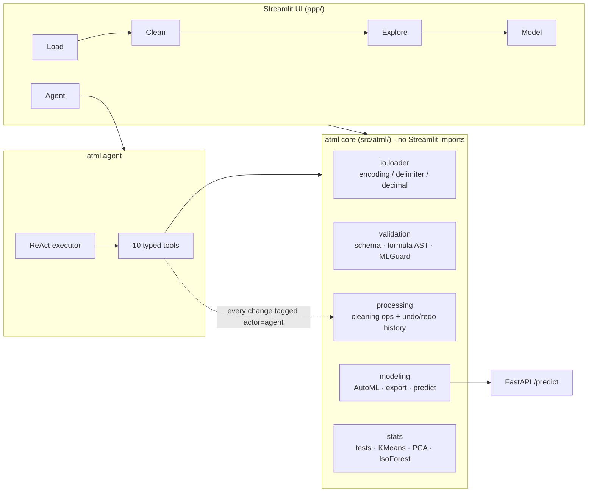

# agentic-tabular-ml

A no-code tabular ML platform where an LLM agent is a **constrained operator**, not the
whole product. Load a messy spreadsheet, clean it, train models, serve them — and let an
agent do the same work through the same guarded tools, with every step logged and undoable.


[](https://www.python.org/)
[](LICENSE)

**Live demo:** _(Streamlit Community Cloud link goes here once deployed)_

---

## Why this exists

Most "AutoML dashboard" projects fail in the same three ways, and this repository is
organised around not doing that:

| Common failure | What this does instead |
| --- | --- |
| The LLM is handed the DataFrame and asked to be careful | The agent never sees data. It calls ten typed tools and reads short text observations |
| The agent's edits are invisible and irreversible | Every mutation goes through one history stack tagged `actor="agent"`; the sidebar undoes any of them |
| Ten models on a leaderboard, no cross-validation, scores from the training set | Three model families per task, K-fold CV for ranking, one held-out test set scored once |
| `eval()` behind a "calculated column" box | Formulas are parsed to an AST and restricted to a whitelist. `__import__` cannot be expressed |
| A dashboard that cannot leave the browser | The trained pipeline exports to `joblib` and is served by a FastAPI endpoint |

---

## Architecture



The core has no Streamlit dependency, which is why it is testable: of 86 tests, 75 run
against `atml.*` directly and 11 drive the Streamlit pages through `AppTest`.

---

## The parts worth reading

### 1. A loader that reports its guesses (`src/atml/io/loader.py`)

Turkish spreadsheet exports are CP1254 with `;` delimiters and `1.250,50` decimals.
pandas' defaults turn `Şükrü` into `Åžükrü` and leave numbers as strings — silently.
This loader detects encoding (BOM first, then strict UTF-8, then CP1254 before Latin-1,
which would "succeed" on anything while mangling Turkish letters), scores delimiters by
field-count consistency so a comma inside `"Ali, Veli"` cannot outvote the real `;`,
and returns a `LoadReport` naming every decision.

```python
df, report = load_file(path.read_bytes(), "kayit.csv")
# report.encoding='cp1254'  report.delimiter=';'  report.decimal=','
# report.numeric_conversions=['ağırlık']
```

### 2. Guards that refuse, with a reason

`MLGuard` runs before any model is fitted and returns errors (blocking) and warnings:
datetime targets, single-class targets, classes below the minimum sample count, near-unique
text columns that are really IDs, zero-variance columns, >60% missingness, multicollinear
pairs, and features correlating with the target at r > 0.999 — the classic leakage smell.

The formula evaluator refuses anything outside arithmetic plus nine whitelisted functions.
The agent gets `"Formula rejected: ..."` back as an observation and adapts, rather than
crashing the executor.

### 3. Honest AutoML (`src/atml/modeling/automl.py`)

Three model families per task. Preprocessing lives inside the sklearn `Pipeline`, so
imputation and scaling are fitted per fold and there is no leakage into cross-validation.
The leaderboard shows CV mean and standard deviation on the training split; test scores
are computed once, on data no model saw, and the UI states which is which. Feature
importance is permutation importance on the test set, so it is comparable across model
types and unaffected by one-hot expansion.

### 4. The agent is the thin part

```
inspect_data · summary_statistics · check_normality · impute_column · clip_outliers
convert_type · add_column · filter_rows · train_model · undo_last
```

That is the entire action space. `train_model` runs `MLGuard` first and returns the report
instead of training when it fails. Tools are tested **without an LLM** — the guarantee under
test is that the guard rails hold regardless of what a model asks for.

---

## Quick start

```bash
git clone https://github.com/MelihOrel/agentic-tabular-ml.git
cd agentic-tabular-ml

pip install -e ".[app,api,dev]"
python scripts/make_sample_data.py   # writes data/samples/
pytest                                # 86 tests
streamlit run app/main.py             # http://localhost:8501
```

On the **Load** page pick `keci_surusu_cp1254.csv`. It is deliberately awkward — CP1254,
`;` delimiter, `,` decimals, Turkish column names, injected missing values and outliers —
so the load report has something to show.

Docker:

```bash
docker build -t atml . && docker run -p 8501:8501 atml
```

Serving a trained model (export from the Model page first):

```bash
ATML_MODEL_PATH=models/champion.joblib uvicorn api.main:app --reload
# GET /model lists the exact feature columns the export expects
curl -X POST localhost:8000/predict -H 'Content-Type: application/json' \
  -d '{"rows":[{"ırk":"Saanen","bölge":"Çukurova","yaş":4,"canlı_ağırlık_kg":52.1}]}'
```

The agent page needs `OPENAI_API_KEY` (copy `.env.example` to `.env`). Nothing else does.

---

## Layout

```
src/atml/          core library, no UI dependency
  config.py        config.yaml is the only place settings live
  dtypes.py        pandas 2/3 safe dtype helpers
  io/loader.py     encoding, delimiter, decimal detection + LoadReport
  validation/      report · schema · formula (AST) · guard (MLGuard)
  processing/      history (undo/redo) · cleaning operations
  modeling/        automl · save/load · predict_frame
  stats/           descriptives · tests · KMeans · IsolationForest · PCA
  agent/           session · tools · react_agent
app/               Streamlit: main.py, state.py, pages/1..5
api/main.py        FastAPI /health /model /predict
tests/             86 tests incl. AppTest page smoke tests
scripts/           sample data generation
```

---

## Notes on the data and the numbers

The files under `data/samples/` are **synthetic**, generated by
`scripts/make_sample_data.py` with a fixed seed. They exist to exercise the loader and give
the demo something to chew on. They are not measurements and support no claim about goats,
dairy production or anything else.

No metric is quoted in this README, because the metric depends entirely on the file you
upload. The app reports its own numbers and labels which split they came from.

Two behaviours documented rather than hidden:

- **Shapiro-Wilk rejects genuinely normal samples at large n.** At n = 5000 it flags
  normal data as non-normal routinely; that is the test's power, not a defect. The suite
  asserts this explicitly (`tests/test_stats.py`) instead of picking a seed where it passes.
- **`series.dtype == object` silently stops matching text columns on pandas 3**, which
  disabled the ID-column warning until a test caught it. `atml/dtypes.py` is the fix and
  `TestPandas3Compatibility` is the regression test.

## Roadmap

- Conformal prediction intervals for regression targets
- SHAP explanations alongside permutation importance
- MLflow run tracking so the leaderboard persists across sessions
- Time-series mode when a datetime index is detected

## License

MIT — see [LICENSE](LICENSE).
